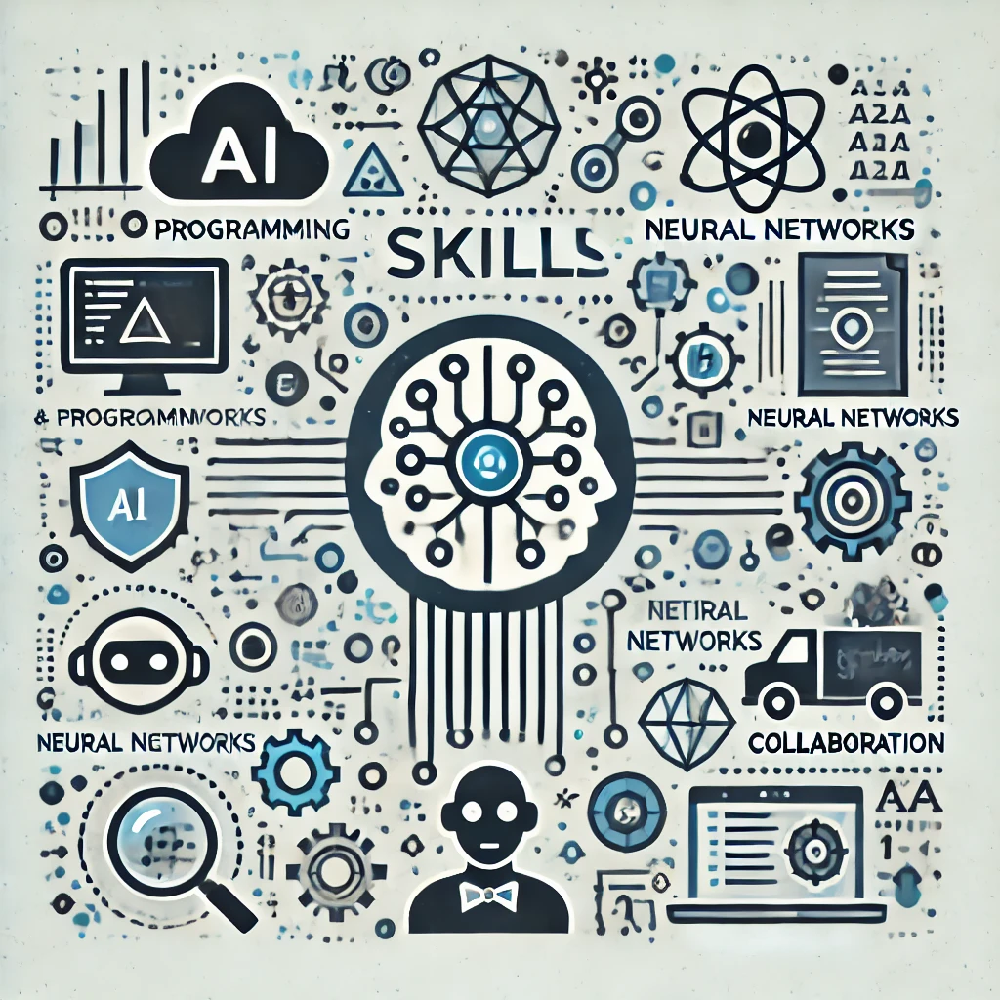

# lesson7.1
Introduction to Web Parsing / Введение в веб-парсинг

---

# Проект: Веб-страница о профессии специалиста по искусственному интеллекту

## Описание
Этот проект представляет собой учебную веб-страницу, созданную для демонстрации навыков разработки HTML и CSS.

## Функциональность
- **Основная информация о профессии:** включает разделы, посвящённые описанию работы специалиста по ИИ, его обязанностям, навыкам и карьерным перспективам.
- **Адаптивный дизайн:** интерфейс автоматически подстраивается под различные размеры экрана.
- **Графическое оформление:** добавлены тематические изображения, иллюстрирующие контекст каждого раздела.

## Технологии
- HTML5
- CSS3
- Генерация изображений с помощью DALL·E

## Структура проекта
- **index.html:** Основной HTML-файл веб-страницы.
- **Изображения:** Четыре изображения, иллюстрирующие разные аспекты профессии специалиста по ИИ:
  1. Специалист за работой.
  2. Обязанности специалиста.
  3. Необходимые навыки.
  4. Карьерный путь.

## Как запустить проект
1. Склонируйте репозиторий:
   ```bash
   git clone https://github.com/Shch2295404/lesson7.1.git
   ```
2. Перейдите в папку проекта:
   ```bash
   cd lesson7.1
   ```
3. Откройте файл `index.html` в любом браузере.

## Примеры изображений
### 1. Специалист по искусственному интеллекту за работой


### 2. Основные обязанности


### 3. Навыки специалиста


### 4. Карьерный путь


## Задачи проекта
- Продемонстрировать навыки работы с HTML и CSS.
- Практиковать структурирование информации.
- Использовать генерацию изображений для тематического оформления.

## Автор
Этот проект разработан в учебных целях. Если у вас есть вопросы или предложения, свяжитесь со мной через [GitHub](https://github.com/Shch2295404).

---

Спасибо за внимание к моему проекту!

